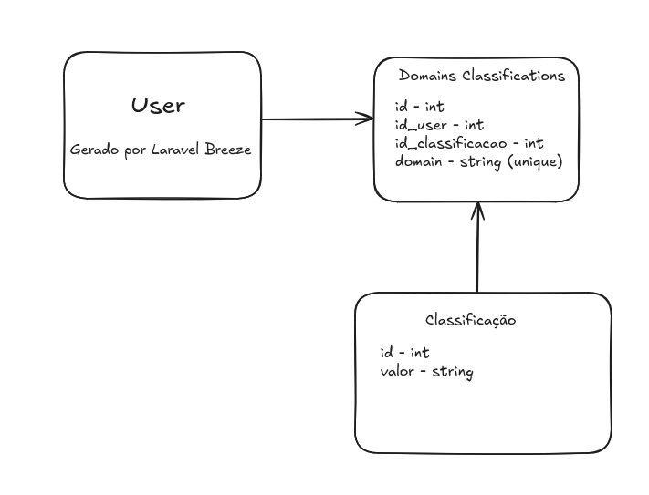

# Teste Lumiun

O teste consiste em uma aplicação Laravel, com front-end em Livewire, para trabalhar com listas de domínios, validá-los e categorizá-los com Inteligência Artificial.

Para a realização do que foi solicitado, passei por alguns processos, e o primeiro deles foi o desenho de projeto, para facilitar o entendimento sobre o que foi pedido. Então, cheguei a este diagrama de classes:



Após isto, comecei a pensar qual o melhor modelo para realizar de pastas para o projeto, pensei em utilizar Traits para o domínio, já que haveria poucas funcionalidades, mas optei por manter a validação dentro da model. Para as requisições com IA, utilizei Jobs, para também utilizar de filas e manter a aplicação sem perigos de sobrecarga. Por fim, utilizei Laravel Sail para não ocorrer problemas de ambiente, nem divergências durante o desenvolvimento e a testagem.

## Passo a passo para funcionamento do sistema.

Durante o desenvolvimento, troquei de modelo algumas vezes na tentativa de oferecer a menor quantidade de erros, e optei por utilizar Gemini na versão final.
Apesar de open-source, o DeepSeek esteve com a API fora do ar desde o dia em que o teste foi enviado. Mesmo sendo a minha opção favorita, não foi possível. Com o ChatGPT da OpenAI foram realizados 1 dia e meio de testes, mas depois da segunda tentativa ele falhava e solicitava pagamentos (uso da versão PRO). Por fim, aderi ao Gemini, que também esteve fora do ar e também solicita pagamentos, mas até agora, foi o que mais permitiu testes e utilização sem pagamentos.

[Obtenha suas credenciais](CREDENCIAIS_GEMINI.md)

### Primeiros passos

clone o repositório na sua máquina:

```bash
git clone git@github.com:svitorz/teste-lumiun.git
cd teste-lumiun
```

Agora, comece instalando as dependências do projeto com o comando

```bash
./vendor/bin/sail composer install
```

Copie as informações do .env.example, em que dexei um modelo parecido com o utilizado durante o desenvolvimento

```bash
cp .env.example .env
```

Lembre-se de colocar sua chave de acesso do Gemini no .env, se você fizer como no passo a passo, a o valor estará logo no início do arquivo.
A partir daqui, você deverá manter o servidor rodando, pode fazer isso com Sail

```bash
./vendor/bin/sail up -d
```

A flag -d para permitir que você continue utilizando este terminal enquanto a aplicação está rodando.

Então, rode a geração da chave para sua aplicação, necessário para que ela funcione,e também já execute as migrations, para que as tabelas da base de dados sejam criadas.

```bash
./vendor/bin/sail artisan key:generate
./vendor/bin/sail artisan migrate
```

Também é importante executar os seeders, para criar os valores da tabela de categorias.

```bash
./vendor/bin/sail artisan db:seed CategorySeeder
```

Instale as dependências do Javascript.

```bash
./vendor/bin/sail npm install
./vendor/bin/sail npm run dev
```

Por fim, em outro terminal, ative os jobs:

```bash
./vendor/bin/sail artisan queue:work
```

Agora, acesse:

```bash
http://localhost
```

E tudo estará pronto para os testes. (OBS: é possível que haja erros, principalmente caso a API do Google receba muitas requisições ou esteja fora do ar. Para verificar se há erros, você pode verificar os arquivos de log: storage/logs/laravel.log)
